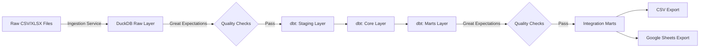

# Finance Analytics Pipeline

> A production-grade, local-first data pipeline for personal finance analytics built with modern data engineering best practices.

[](https://www.python.org/downloads/)
[](https://python-poetry.org/)
[](https://github.com/psf/black)
[](https://github.com/astral-sh/ruff)
[](https://mypy-lang.org/)

## Overview

A fully local, lake-less data pipeline designed for personal finance analytics that combines enterprise-grade tooling with the simplicity of a single-file database. Built for reliability, maintainability, and ease of operation.

### Key Features

- **Contract-Driven Ingestion**: YAML-based data contracts ensure schema validation before ingestion
- **Medallion Architecture**: Three-layer dbt transformation (Staging → Core → Marts)
- **Data Quality Gates**: Automated Great Expectations checkpoints at ingestion and mart layers
- **Idempotent Operations**: MD5-based deduplication prevents duplicate processing
- **Incremental Exports**: High-watermark tracking for efficient Google Sheets updates
- **Dockerized Pipeline**: Bind-mounted volumes for hot-reload development
- **Comprehensive Testing**: Unit, integration, Dagster, and E2E test suites

## Technology Stack

| Layer | Technology | Purpose |
|-------|-----------|---------|
| **Orchestration** | Dagster | Asset-based orchestration with dependency management |
| **Data Warehouse** | DuckDB | Single-file OLAP database with ACID guarantees |
| **Transformation** | dbt-duckdb | SQL-based transformations with testing & documentation |
| **Data Quality** | Great Expectations | Automated validation checkpoints |
| **Dependency Mgmt** | Poetry | Python dependency and virtual environment management |
| **Containerization** | Docker | Isolated runtime with bind-mount hot-reload |

## Architecture

### Pipeline Flow



### Data Layering Strategy

```
prod_raw/          # Text-only ingested data with load metadata
  ├── bakai_transactions
  ├── bybit_spot_orders
  └── telegram_p2p_trades

prod_stg/          # Cleaned & typed data (column mappings applied)
  ├── stg_load_bakai_transactions
  ├── stg_load_bybit_spot_orders
  └── stg_load_telegram_p2p_trades

prod_core/         # Business logic & standardization
  ├── core_load_bakai_transactions
  ├── core_load_bybit_spot_orders
  └── core_load_telegram_p2p_trades

prod_mart/         # Aggregated analytics tables
  ├── mart_load_bakai_transactions
  ├── mart_load_bybit_spot_orders
  └── mart_load_telegram_p2p_trades

prod_imart/        # Cross-source unified views
  └── imart_bind_transactions  # All transactions unified
```

### Directory Structure

```
finance-analytics-pipeline/
├── orchestration/
│   └── dagster_project/          # Dagster assets, jobs, schedules
│       ├── assets_ingest.py      # Ingestion orchestration
│       ├── assets_transform.py   # dbt orchestration
│       ├── assets_quality.py     # GX checkpoint orchestration
│       └── assets_export_*.py    # Export orchestration
│
├── transform/dbt/
│   ├── models/
│   │   ├── staging/              # Raw → Typed transformations
│   │   ├── core/                 # Business logic layer
│   │   ├── marts/                # Analytics aggregations
│   │   └── integration_marts/    # Cross-source views
│   ├── macros/                   # Reusable dbt macros
│   ├── seeds/                    # Column mappings & reference data
│   └── profiles/                 # dbt connection config
│
├── src/
│   ├── ingestion/
│   │   ├── service.py            # Contract-driven ingestion engine
│   │   └── contracts.py          # YAML contract parser
│   ├── export/
│   │   ├── csv_exporter.py       # Snapshot CSV exporter
│   │   └── sheets_exporter.py    # Incremental Google Sheets exporter
│   ├── duckdb_utils.py           # DuckDB helper functions
│   └── utils.py                  # General utilities
│
├── data/
│   ├── contracts/                # YAML data contracts (schema definitions)
│   ├── raw/                      # Parquet ingestion cache
│   ├── warehouse/                # DuckDB database file (analytics.duckdb)
│   └── quality/gx/               # Great Expectations configuration
│
├── tests/
│   ├── unit/                     # Fast isolated tests
│   ├── integration/              # DuckDB + dbt integration tests
│   ├── dagster/                  # Dagster asset tests
│   └── e2e/                      # Full pipeline validation
│
├── docker-compose.yml            # Docker orchestration
├── Dockerfile                    # Python 3.11 + Poetry container
├── pyproject.toml                # Poetry dependencies & tool config
├── Makefile                      # Development workflow shortcuts
└── .env                          # Environment configuration (gitignored)
```

## Quick Start

### Prerequisites

- **Docker Desktop**: With file sharing enabled for your data drive
- **Poetry** (optional for local dev): `curl -sSL https://install.python-poetry.org | python3 -`
- **Google Cloud Service Account** (optional for Sheets export): JSON key file with Sheets API access

### Initial Setup

1. **Clone and install dependencies:**
   ```bash
   git clone <repository-url>
   cd finance-analytics-pipeline
   poetry install
   ```

2. **Configure environment:**
   ```bash
   cp env.example .env
   # Edit .env with your paths and credentials
   ```

   Key variables:
   ```bash
   FINANCE_DIR_HOST=G:/USER/DATA/FINDNA           # Windows path with forward slashes
   DUCKDB_PATH=/app/data/warehouse/analytics.duckdb
   FINANCE_HISTORY_EXPORT_TABLE=prod_imart.view_transactions
   ```

3. **Set up Google Sheets integration (optional):**
   - Create service account in GCP Console
   - Download JSON key to `credentials/finance-sheets-writer-prod-sa.json`
   - Share target spreadsheet with service account email
   - Update `.env` with spreadsheet ID and sheet name

4. **Start the pipeline:**
   ```bash
   docker compose up --build -d
   ```

5. **Access Dagster UI:**
   - Navigate to http://localhost:3000
   - View assets, schedules, and run history
   - Materialize assets manually or wait for scheduled runs

## Development Workflow

### Local Development Commands

```bash
# Setup (first time)
make setup                  # Install deps + pre-commit hooks

# Code Quality
make lint                   # Run ruff + black + mypy
make fmt                    # Auto-format code

# Testing
make test                   # Run all tests
make test-unit              # Fast unit tests only
make test-integration       # Integration tests with DuckDB
make test-dagster           # Dagster asset tests
make test-e2e               # End-to-end pipeline validation

# dbt Development
make dbt-build              # Build all dbt models
make dbt-test               # Run dbt tests
make dbt-lint               # Lint dbt SQL files

# Docker Operations
make up                     # Start Dagster + worker
make down                   # Stop services
```

### Hot-Reload Development

The project uses **bind mounts** for hot-reload development:

✅ **No rebuild needed** for:
- Python code changes in `src/`, `orchestration/`
- dbt model changes in `transform/dbt/models/`
- Data contracts in `data/contracts/`

⚠️ **Restart required** (no rebuild) for:
- Environment variable updates in `.env`

```bash
# Restart to pick up .env changes (no rebuild needed)
docker compose restart
```

⚠️ **Rebuild required** for:
- Dependency changes in `pyproject.toml`
- Dockerfile modifications
- docker-compose.yml changes

```bash
# Rebuild after dependency or Docker changes
docker compose up --build -d
```

## Data Contract System

All data sources require a YAML contract before ingestion. Contracts define schema, parsing rules, and metadata.

**Example Contract** (`data/contracts/bakai_transactions.yaml`):

```yaml
version: 1.0.0
dataset: bakai_transactions
description: Raw transaction export from Bakai Bank
owner: finance-analytics-team
domain: banking
source_system: Bakai Bank
format: XLSX
encoding: utf-8
skip_header_rows: 16
skip_footer_rows: 6

target_table:
  schema: prod_raw
  name: bakai_transactions

columns:
  - name: "№ док."
    type: varchar
    nullable: true
    description: Bank document number
    source_column_index: 0

  - name: "Дата"
    type: varchar
    nullable: false
    description: Transaction timestamp
    source_column_index: 1
    format: "%d.%m.%Y %H:%M:%S"

  - name: "Дебет"
    type: varchar
    nullable: true
    description: Debit amount
    source_column_index: 3

metadata:
  refresh_frequency: monthly
  data_classification: internal
  retention_period_days: 2555
  file_pattern: "*.xlsx"
```

## Adding a New Data Source

Follow this workflow to onboard a new data source:

### 1. Create Data Contract

```bash
# Create contract file
touch data/contracts/new_source_transactions.yaml
```

Define schema, parsing rules, and metadata (see example above).

### 2. Place Data Files

```bash
# Bank data
{FINANCE_DIR}/To Parse/Bank/{source}/{data_type}/file.csv

# Crypto data
{FINANCE_DIR}/To Parse/Crypto/{platform}/{transaction_type}/file.csv
```

### 3. Create dbt Models

```bash
# Staging layer (type casting)
touch transform/dbt/models/staging/new_source/stg_load_new_source_transactions.sql

# Core layer (business logic)
touch transform/dbt/models/core/new_source/core_load_new_source_transactions.sql

# Mart layer (analytics)
touch transform/dbt/models/marts/new_source/mart_load_new_source_transactions.sql
```

### 4. Add Column Mappings

Edit `transform/dbt/seeds/mappings/transactions_column_map.csv` to define standardized column names and types.

### 5. Test & Validate

```bash
# Run ingestion
make up  # Start pipeline

# Check Dagster UI for ingestion success
# http://localhost:3000

# Build dbt models
make dbt-build

# Run tests
make test-integration
```

## Pipeline Orchestration

### Available Jobs

The pipeline defines four jobs that can be executed manually or scheduled:

| Job | Description |
|-----|-------------|
| `build_finance_data_pipeline` | Ingest → Transform → Validate (stg/core/mart layers) |
| `export_pipeline` | Build imart → Export CSV & Sheets |
| `maintenance_pipeline` | Archive files → Cleanup exports |
| `monthly_full_pipeline` | Run all three pipelines sequentially |

### Scheduled Jobs

Currently, only one schedule is configured:

| Job | Schedule | Description |
|-----|----------|-------------|
| `monthly_full_pipeline` | 1st of month 06:00 (cron: `0 6 1 * *`) | Complete pipeline: ingest, transform, export, maintenance |

**Note**: The other jobs (`build_finance_data_pipeline`, `export_pipeline`, `maintenance_pipeline`) are defined but not scheduled. They can be triggered manually via Dagster UI or scheduled by adding `ScheduleDefinition` entries in `orchestration/repo.py`.

### Manual Execution

In Dagster UI:
1. Navigate to **Jobs**
2. Select job to run
3. Click **Launch Run**
4. View logs and asset materializations

## Data Quality

Great Expectations checkpoints run at two critical stages:

### 1. Post-Ingestion Validation

Validates raw data immediately after ingestion:
- Column presence
- Data type compatibility
- Null constraint adherence
- Row count thresholds

### 2. Post-Mart Validation

Validates final analytics tables:
- Business rule compliance
- Referential integrity
- Aggregate consistency
- Expected value ranges

Failed validations:
- Block downstream assets
- Generate detailed failure reports
- Trigger alerting (if configured)

Configuration: `data/quality/gx/great_expectations.yml`

## Export Destinations

### CSV Snapshots

- **Location**: `{FINANCE_DIR}/exports/csv/{date}/`
- **Contents**: Full snapshot of `FINANCE_HISTORY_EXPORT_TABLE`
- **Artifacts**:
  - `data.csv` - Full export
  - `latest.csv` - Symlink to most recent
  - `manifest.json` - Metadata (row count, MD5, timestamp)

### Google Sheets

- **Mode**: Incremental (high-watermark based on `transaction_dt`)
- **Bookmark**: Stored in `prod_meta.export_bookmarks`
- **Deduplication**: Only new transactions since last export
- **Rate Limiting**: Batched writes to respect API limits

## Code Quality Standards

### Enforced Rules

- **Line Length**: 100 characters (Black, Ruff)
- **Type Hints**: Required on all functions (mypy strict mode)
- **Import Sorting**: Automated via Ruff
- **Docstrings**: Required on public functions
- **String Formatting**: f-strings preferred over `.format()`

### Pre-Commit Hooks

Automatically run on `git commit`:
- Ruff linting
- Black formatting
- mypy type checking
- Trailing whitespace removal
- YAML syntax validation

Install hooks:
```bash
make setup
```

## Testing Strategy

### Test Pyramid

```
        /\
       /e2e\        # Full pipeline integration (few)
      /------\
     /integr.\     # DuckDB + dbt tests (some)
    /----------\
   /   unit     \  # Fast isolated tests (many)
  /--------------\
```

### Test Markers

Use pytest markers to run specific test suites:

```bash
pytest -m unit              # Unit tests only
pytest -m integration       # Integration tests
pytest -m dagster          # Dagster asset tests
pytest -m e2e              # End-to-end tests
```

### Coverage Requirements

- Unit tests: >80% coverage on `src/` modules
- Integration tests: Cover all dbt model layers
- E2E tests: Validate complete pipeline workflows

## Troubleshooting

### Common Issues

#### 1. Docker Volume Access Errors

**Symptom**: `Permission denied` or `File not found` errors

**Solution**:
- Ensure Docker Desktop has file sharing enabled for your drive
- Verify paths in `.env` use forward slashes (even on Windows)
- Check `FINANCE_DIR_HOST` points to correct location

#### 2. Google Sheets Authentication Fails

**Symptom**: `401 Unauthorized` or `403 Forbidden`

**Solution**:
- Verify service account JSON is valid
- Ensure spreadsheet is shared with service account email
- Check `GOOGLE_SA_JSON_PATH` points to correct file

#### 3. dbt Models Fail to Build

**Symptom**: `Compilation Error` or `Database Error`

**Solution**:
- Check DuckDB file exists: `ls -lh data/warehouse/analytics.duckdb`
- Verify raw tables exist: Run ingestion first
- Check dbt syntax: `make dbt-parse`

#### 4. Ingestion Skips Files

**Symptom**: Files in directory but not ingested

**Solution**:
- Check MD5 in `prod_meta.ingest_ledger` (may be duplicate)
- Verify file stability (pipeline waits 8 seconds for upload completion)
- Ensure data contract exists for the data source

### Viewing Logs

```bash
# Follow worker logs
docker compose logs worker -f

# View Dagster daemon logs
docker compose logs dagster-daemon -f

# Check recent logs
docker compose logs --tail=100 worker
```

### Inspecting DuckDB

```bash
# Connect to warehouse
poetry run python -c "
import duckdb
con = duckdb.connect('data/warehouse/analytics.duckdb')
con.execute('SHOW TABLES').show()
"

# Query specific table
poetry run python -c "
import duckdb
con = duckdb.connect('data/warehouse/analytics.duckdb')
con.execute('SELECT * FROM prod_mart.mart_load_bakai_transactions LIMIT 5').show()
"
```

## Performance Considerations

### DuckDB Optimization

- **Single File**: All data in one `.duckdb` file for simplicity
- **Column Store**: Efficient for analytical queries
- **Parallel Execution**: Automatic query parallelization
- **Memory Management**: Configurable via environment variables

### dbt Optimization

- **Incremental Models**: Use for large, append-only tables
- **Materialization Strategy**: Tables for marts, views for integration marts
- **Model Selection**: Use `--select` to build specific models
- **dbt Artifacts**: Cached in `transform/dbt/target/`

### Pipeline Optimization

- **Parallel Asset Execution**: Dagster automatically parallelizes independent assets
- **Parquet Caching**: CSV/XLSX converted to Parquet for fast re-ingestion
- **Incremental Exports**: Only new data exported to Google Sheets
- **File Stability Checks**: Prevents processing incomplete uploads

## Security Best Practices

### Secrets Management

- ✅ Store credentials in `.env` (gitignored)
- ✅ Use service accounts for Google Sheets (not personal accounts)
- ✅ Rotate service account keys periodically
- ✅ Restrict file permissions on credential files

```bash
chmod 600 credentials/*.json
chmod 600 .env
```

### Data Privacy

- ✅ All data processed locally (no cloud uploads except Sheets export)
- ✅ DuckDB file encrypted at rest (if using encrypted filesystem)
- ✅ No telemetry or external logging
- ✅ Audit trail via `prod_meta.ingest_ledger`

## Contributing

### Commit Message Convention

Use imperative, capitalized commit messages:

✅ Good:
- `Add Bybit spot orders ingestion`
- `Fix currency conversion in core layer`
- `Update dbt column mappings for Telegram`

❌ Bad:
- `added bybit orders`
- `fixed bug`
- `updates`

### Pull Request Checklist

- [ ] Code passes `make lint` and `make fmt`
- [ ] All tests pass: `make test`
- [ ] New features include tests
- [ ] dbt models include tests and documentation
- [ ] `.env.example` updated if new variables added
- [ ] CHANGELOG.md updated (if user-facing changes)

## License

[Specify your license here]

## Support

For issues, questions, or contributions:
- **Issues**: [GitHub Issues](your-repo-url/issues)
- **Documentation**: See `docs/` directory
- **Slack/Discord**: [Your community link]

---

**Built with ❤️ using modern data engineering best practices**
