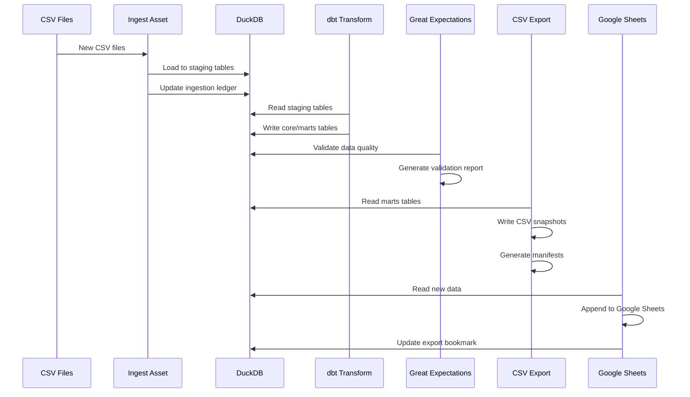

# Architecture

## System Overview

The Finance Analytics Pipeline is a local data pipeline designed to process CSV files and export results to both CSV files and Google Sheets.

## Core Components

### 1. Orchestration (Dagster)
- **Assets**: Modular data processing units
- **Schedules**: Automated monthly runs at 1st day of the month at 06:00
- **Dependencies**: Clear asset lineage and execution order
- **UI**: Web interface for monitoring and manual runs

### 2. Data Warehouse (DuckDB)
- **Single file**: `warehouse.duckdb` contains all data
- **ACID compliance**: Reliable data integrity
- **SQL interface**: Standard SQL queries and analytics

### 3. Transformations (dbt)
- **Staging**: Raw data normalization and type casting
- **Core**: Business logic and deduplication
- **Marts**: Final export-ready tables
- **Tests**: Data quality validation

### 4. Data Quality (Great Expectations)
- **Checkpoints**: Automated validation runs
- **Expectations**: Data quality rules and constraints
- **Reports**: Validation results and data docs
- **Integration**: Runs after dbt transformations

### 5. Exports
- **CSV Snapshots**: Full daily exports with metadata
- **Google Sheets**: Incremental updates with bookmarks
- **Manifests**: Export metadata (row count, MD5, timestamps)

## Data Flow



## File System Layout

### Host Paths (Windows-friendly)
```
G:/USER/DATA/FINDNA/           # Import CSV files
G:/USER/DATA/FINDNA/RESULT/    # Export CSV files
```

### Container Paths
```
/app/data/raw/                 # CSV import directory
/app/data/warehouse/           # DuckDB storage
/app/data/exports/csv/          # CSV export directory
/app/data/exports/metadata/     # Export metadata
```

## Volume Mounts

```yaml
volumes:
  - "${FINANCE_DIR_HOST}:${FINANCE_DATA_DIR_CONTAINER}:rw"           # Finance data imports and exports
  - ./data/warehouse:/app/data/warehouse           # DuckDB persistence
  - ./credentials:/app/credentials:ro              # Google credentials
```

## Idempotency Mechanisms

### 1. Ingestion Ledger
```sql
CREATE TABLE meta.ingest_ledger(
  filename TEXT PRIMARY KEY,
  size BIGINT,
  md5 TEXT,
  ingested_at timestamp
);
```

### 2. Export Bookmarks
```sql
CREATE TABLE meta.export_bookmark(
  dataset TEXT PRIMARY KEY,
  last_ts timestamp,
  last_id BIGINT
);
```

## Error Handling

### 1. File Stability
- Wait 8 seconds for file stability before processing
- Skip files that are still being written

### 2. Data Quality
- Great Expectations validates data before exports
- Failed validations prevent downstream processing

### 3. Export Reliability
- CSV exports include MD5 checksums for integrity
- Google Sheets exports use bookmarks to prevent duplicates

## Performance Considerations

### 1. DuckDB Optimization
- Single file reduces I/O overhead
- Columnar storage for analytics workloads
- Automatic query optimization

### 2. dbt Configuration
- Table materialization for fast reads
- 4 parallel threads for transformations
- Incremental models where applicable

### 3. Export Efficiency
- CSV snapshots: Full daily exports
- Google Sheets: Incremental updates only
- Batch processing for large datasets

## Security

### 1. Credentials
- Google service account JSON mounted read-only
- No credentials in version control
- Environment variables for configuration

### 2. Data Access
- Local processing only
- No external data transmission except Google Sheets
- DuckDB file permissions controlled by host system

## Monitoring

### 1. Dagster UI
- Asset materialization status
- Run history and logs
- Dependency visualization
- Manual run triggers

### 2. Logs
- Container logs via `docker compose logs`
- Dagster execution logs
- dbt build logs
- Great Expectations validation reports

### 3. Health Checks
- Docker container health status
- DuckDB connectivity
- Export file verification


