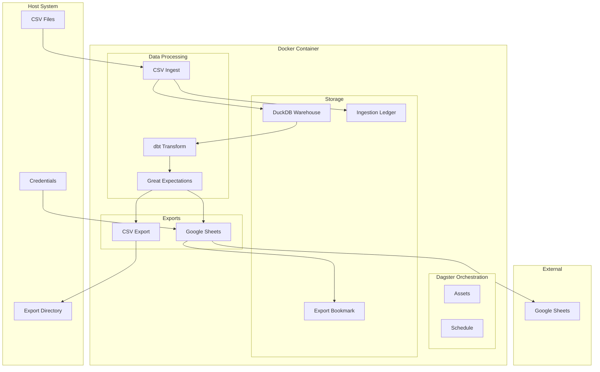
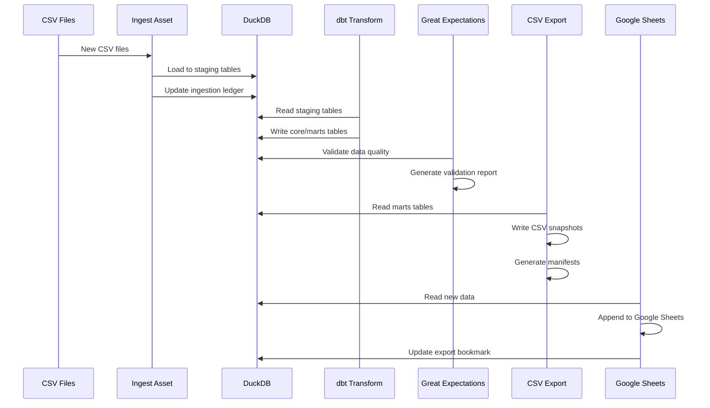
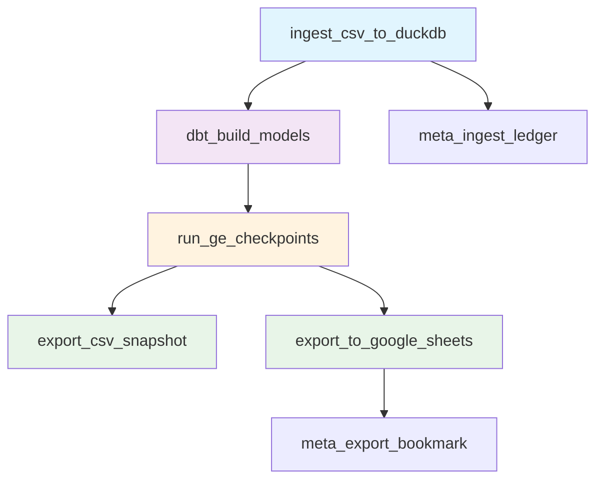
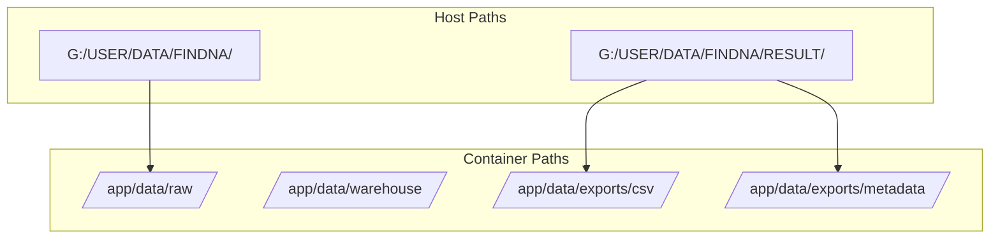
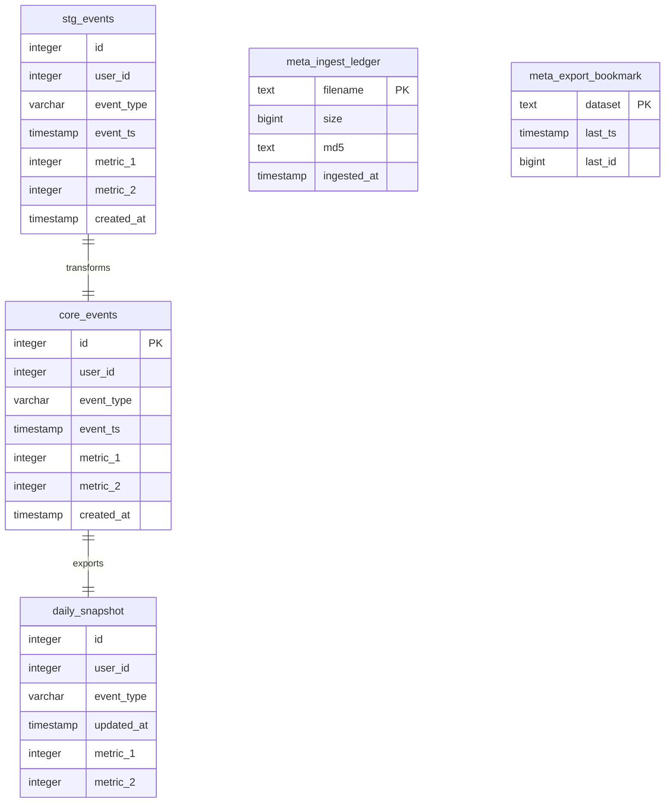
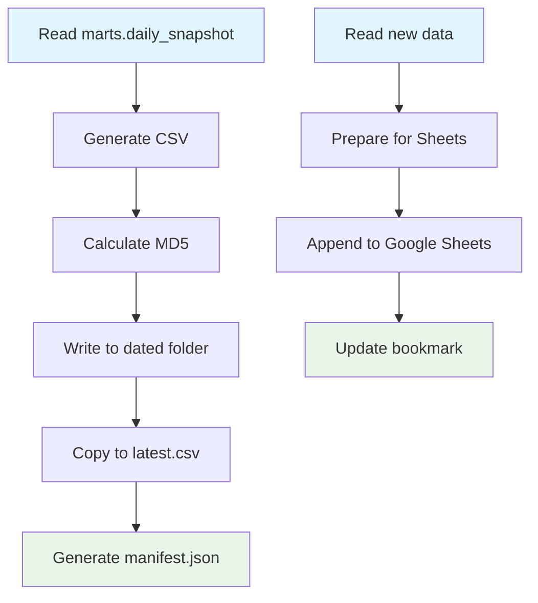
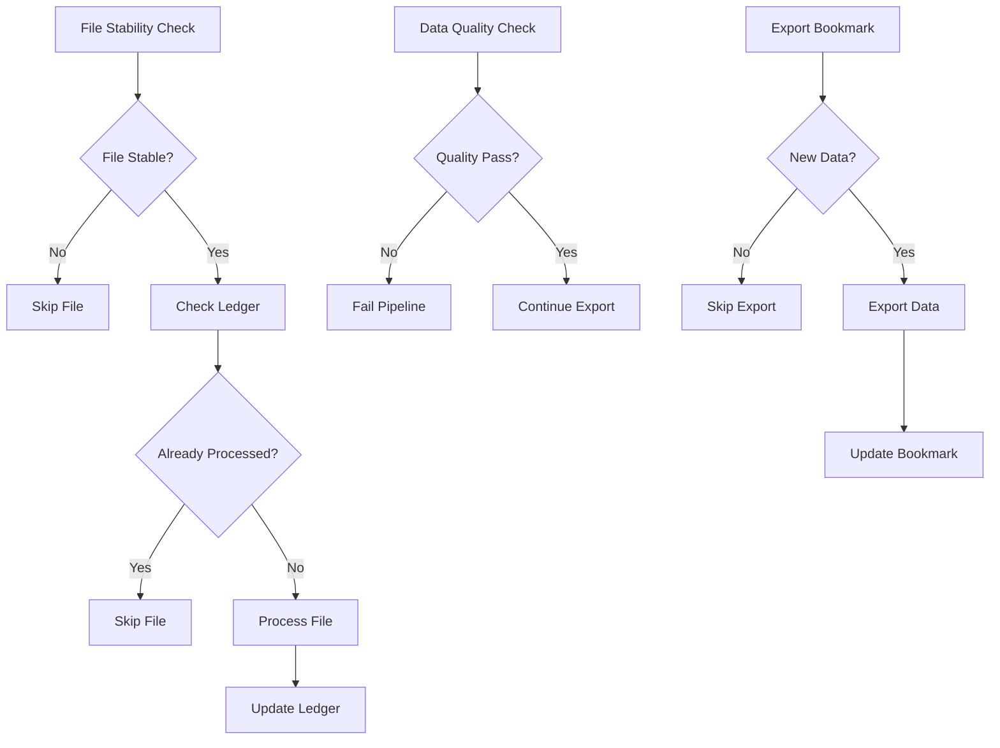
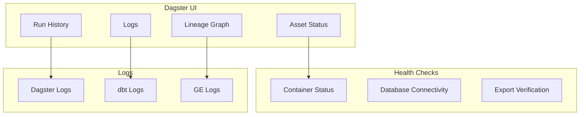

# Diagrams

## System Architecture



## Data Flow



## Asset Dependencies



## File System Layout



## Volume Mounts

```mermaid
graph LR
    subgraph "Host"
        A[IMPORT_CSV_PATH]
        B[EXPORT_CSV_PATH]
        C[credentials/]
        D[data/warehouse/]
    end
    
    subgraph "Container"
        E[/app/data/raw]
        F[/app/data/exports/csv]
        G[/app/data/exports/metadata]
        H[/app/credentials]
        I[/app/data/warehouse]
    end
    
    A --> E
    B --> F
    B --> G
    C --> H
    D --> I
```

## Database Schema



## Export Process



## Error Handling Flow



## Monitoring Dashboard




