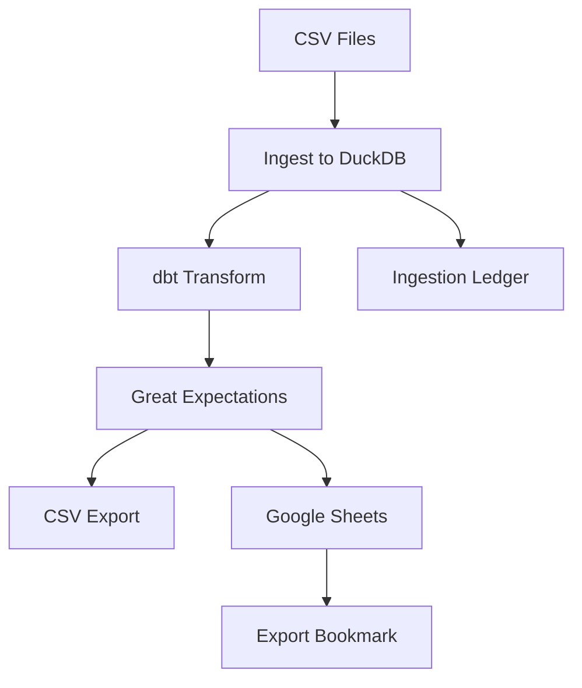

# Finance Analytics Pipeline

A local, lake-less data pipeline using Dagster + DuckDB + dbt-duckdb + Great Expectations.

## 🚀 Quick Start

```bash
# 1. Clone and setup
git clone <your-repo>
cd finance-analytics-pipeline
poetry install

# 2. Configure environment
cp .env.example .env
# Edit .env with your paths and Google Sheet ID

# 3. Add Google credentials
# Place finance-sheets-writer-prod-sa.json in credentials/

# 4. Start the pipeline
make up

# 5. Access Dagster UI
open http://localhost:3000
```

## 📊 Pipeline Overview



## 🏗️ Architecture

- **Orchestrator**: Dagster with assets and schedules
- **Warehouse**: Single DuckDB file (no data lake)
- **Transforms**: dbt with staging → core → marts
- **Quality**: Great Expectations checkpoints
- **Exports**: CSV snapshots + Google Sheets incremental
- **Runtime**: Docker + docker-compose

## 📁 Project Structure

```
finance-analytics-pipeline/
├── orchestration/          # Dagster assets and schedules
├── transform/              # dbt models and tests
├── quality/               # Great Expectations
├── export/                # Export logic and tests
├── data/                  # DuckDB warehouse and exports
├── sample_data/           # Sample CSV files
└── scripts/               # Utility scripts
```

## 🔧 Key Features

- **Idempotent**: Ingestion ledger prevents duplicate processing
- **Incremental**: Google Sheets exports use bookmarks
- **Quality**: Data validation before exports
- **Local**: No cloud dependencies
- **Windows-friendly**: Proper path handling and Docker volumes

## 📈 Monitoring

- **Dagster UI**: http://localhost:3000
- **Asset lineage**: Visual dependency graph
- **Run history**: Success/failure tracking
- **Logs**: Detailed execution logs

## 🛠️ Development

```bash
# Lint and format
make lint
make fmt

# Run tests
make test

# Build dbt models
make dbt-build

# Clean up
make clean
```

## 📚 Documentation

- [Architecture](architecture.md) - System design and components
- [Data Model](data-model.md) - Tables, columns, and relationships
- [Runbook](runbook.md) - Operational procedures
- [Diagrams](diagrams.md) - Visual system diagrams


